# Backend API - Licencias Bot

Este proyecto implementa una API REST en Python (usando Flask) que permite validar licencias, descargar archivos protegidos, verificar actualizaciones y servir archivos desde rutas restringidas mediante Nginx.

---

## ✨ Tecnologías Usadas

- **Lenguaje**: Python 3.x  
- **Framework Web**: Flask  
- **Base de Datos**: MySQL  
- **Variables de entorno**: python-dotenv  
- **Tunnel DB remoto**: Ngrok TCP  
- **Servidor de archivos privados**: Nginx (con X-Accel-Redirect)  
- **Logging**: logging module  

---

## 📁 Estructura del Proyecto

```bash
backend_api/
├── app.py                # Lógica principal de la API
├── .env                  # Configuración de entorno (API Key, DB, paths)
├── actualizacion.json   # Metadatos de archivos actualizables
├── archivos/            # Archivos protegidos (por Nginx)
│   └── archivos_origins.zip
└── validaciones.log      # Archivo de logs generados
```

---

## ⚙️ Instalación y Configuración

1. Clonar el repositorio y navegar al proyecto:

```bash
git clone <repo_url>
cd backend_api
```

2. Crear entorno virtual (opcional pero recomendado):

```bash
python -m venv venv
source venv/bin/activate  # En Windows: venv\Scripts\activate
```

3. Instalar dependencias:

```bash
pip install flask mysql-connector-python python-dotenv
```

4. Configurar tu archivo `.env`:

```ini
API_KEY=tu_clave_api_aqui
DB_HOST=4.tcp.ngrok.io
DB_PORT=16388
DB_USER=root
DB_PASSWORD=
DB_NAME=licencias_bot
UPDATE_FILE=./actualizacion.json
IMG_PATH=C:\bots\backend_api
ZIP_PATH=C:\bots\backend_api
```

5. Ejecutar ngrok para exponer tu base de datos local:

```bash
ngrok tcp 3306
```

Luego copia el host y puerto de ngrok en `DB_HOST` y `DB_PORT`.

6. Ejecutar la API:

```bash
python app.py
```

---

## 👀 Endpoints Disponibles

### POST `/validar`

**Valida una clave de licencia activa.**

- Header: `x-api-key: tu_api_key`
- Body JSON:

```json
{
  "clave": "<clave_licencia>"
}
```

- Respuesta:

```json
{
  "status": "valido",
  "usuario": "nombre_usuario"
}
```

---

### GET `/descargar/img`

**Descarga archivo privado usando Nginx + X-Accel-Redirect.**

- Header: `x-api-key`

---

### GET `/descargar/zip`

**Descarga el archivo ZIP comprimido completo.**

- Header: `x-api-key`

---

### GET `/actualizar`

**Retorna el archivo `actualizacion.json`.**

---

### GET `/__version__`

**Devuelve versión de la API.**

---

## ⚖️ Seguridad y Logs

- Las rutas están protegidas por una API key (header `x-api-key`).
- Todas las solicitudes a `/validar` se registran en `validaciones.log`.
- Las descargas están protegidas y servidas por Nginx usando cabecera `X-Accel-Redirect`.

---

## ⚖️ Diagrama de Arquitectura (Mermaid)

```mermaid
graph TD
    Cliente[Cliente]
    subgraph Backend
      A[Flask app.py] -->|Conecta| DB[(MySQL @ ngrok)]
      A -->|Envía JSON| Cliente
      A -->|Lee| actualizacion.json
      A -->|Valida API Key| Seguridad
      A -->|Redirecciona archivo| Nginx
    end
    Cliente -->|POST /validar\nGET /descargar| A
    A -->|X-Accel-Redirect| Nginx[Nginx Servidor Archivos]
```



---

## 🛠 To-Do / Mejoras Futuras

- [ ] Agregar autenticación JWT en lugar de API key simple  
- [ ] Integrar control de versiones más robusto para actualizaciones  
- [ ] Contenerizar con Docker  

---

## 📞 Contacto

- Para dudas o reportes puedes contactar al desarrollador.
- Camilo Yaya
- https://www.linkedin.com/in/camiloandresyayapoveda/
